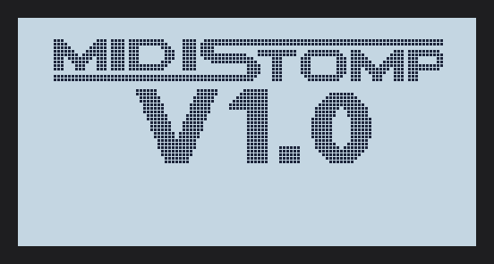
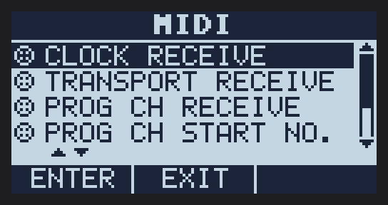
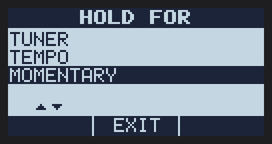
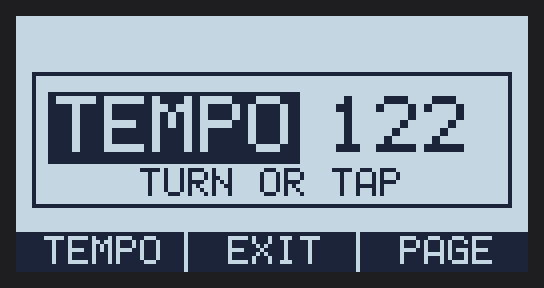
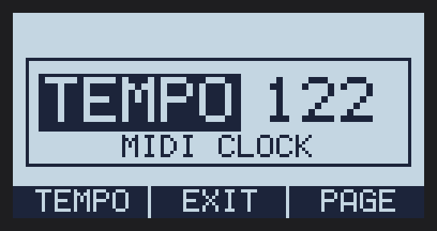
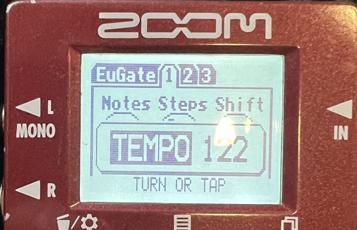

<p align="center"></p>

<h1 align="center">MIDISTOMP</h1>

<p align="center"><b>Custom firmware for the Zoom MultiStomp series of pedals<br>
that adds MIDI control, MIDI clock and new playing aids.</b></p>

<p align="center"><a href="docs/user-guide.md"><b>User guide</b></a> ·
<a href="https://github.com/matujuice/zoom-ms-modding/releases">Download</a> ·
<a href="docs/user-guide.md#5-midi-cc-chart">MIDI chart</a> ·
<a href="#demo">Demo</a></p>

## What you get

| | |
|---|---|
| **Program Change** | loads patches from a DAW, an app or a drum machine |
| **Control Change** | effects 1-6 on/off and every knob, see the [CC chart](docs/user-guide.md#5-midi-cc-chart) |
| **MIDI clock + Start/Stop** | tempo-synced effects follow your clock; custom effects stay on the beat |
| **MIDI menu** | receive on/off per message type, MIDI channel, PC numbering |
| **Tempo screen** | turn the knob or tap, TEMPO LOCK across patches |
| **HOLD FOR** | footswitch hold opens tuner, tempo, or works as a momentary switch |
| **Button combos** | down + right = tuner, down + left = tempo |

<p align="center">  </p>
<p align="center"> </p>
<p align="center"></p>

**Getting it:** download [Zoom's official MS-50G 3.10 updater](https://zoomcorp.com/it/it/multi-effects/multistomp-pedals/ms-50g/ms-50g-support/), drag it onto
`MIDISTOMP-builder.exe` from the [releases](https://github.com/matujuice/zoom-ms-modding/releases),
flash the updater it writes. Full steps and recovery: [user guide](docs/user-guide.md).

## Demo

<!-- DEMO: Luca's video goes here -->
A short video of MIDISTOMP on an MS-60B is coming soon.

---

## For developers

Custom firmware for the Zoom MultiStomp **MS-60B**, **MS-50G** and **MS-70CDR**
(the original models, not the "+" versions), built by patching Zoom's OS.
See [docs/roadmap.md](docs/roadmap.md) for the planned features and
[docs/flashing.md](docs/flashing.md) to build and flash. How work is
organized (backlog issues, cycles, test firmware, releases) is in
[docs/workflow.md](docs/workflow.md).

The three pedals share one platform: the same `.ZDL` effect modules (TI C6000
code) and the same updater flash layout. This repo is one shared codebase with
a build config per pedal in [`models/`](models/).

> Not affiliated with or supported by Zoom. Flashing modified firmware can
> brick a pedal. Read [docs/safety.md](docs/safety.md) first.

## Roadmap

| Phase | What | Writes to pedal? | Status |
|---|---|---|---|
| 0 | Record firmware versions, back up patches and effect lists | no | |
| 1 | Read-only tools: identify pedal, parse updaters and ZDLs, round-trip check | no | **round trip exact on all 3 stock updaters** |
| 2 | Per-model effect sets installed via Effect Manager / SysEx | effect files only | |
| 3 | Our own DSP effects built with TI CGT C6000 | effect files only | |
| 4 | Patched OS images (`zoomms build`, see docs/flashing.md) | firmware | **MIDISTOMP MOD v1.0** |
| 5 | Core firmware research (UI, routing, chain limits) | firmware | research only |

## Usage

```sh
pip install -e '.[midi,dev]'
zoomms identify                         # model + firmware version over USB MIDI
zoomms updater-parts firmware/MS-60B_v2.10_Win_E/'ZOOM MS-60B v2.10 Updater.exe'
zoomms updater-info firmware/MS-60B_v2.00.exe
zoomms updater-extract firmware/MS-60B_v2.00.exe out/ms60b
zoomms updater-verify firmware/MS-60B_v2.00.exe
zoomms zdl-info out/ms60b/*.ZDL
pytest
```

`updater-verify` rebuilds the flash image from what the parser understood and
compares it byte for byte with the original. Phase 4 stays closed until it
reports an exact round trip for the stock updater of every target pedal.

Set `ZOOMMS_ZDL_CORPUS=/path/to/zdls` to run the parser test against a folder
of stock effects (all 830 in the ZoomMultistompZDL corpus parse).

## Layout

```
models/     per-pedal build config (sysex id, chain limit, effect list, stock updater hash)
zoomms/     Python package: updater.py, zdl.py, midi.py, models.py, cli.py
effects/    our DSP effects, one folder each
build/      ZDL / image build scripts (TI CGT C6000)
tests/      unit tests, synthetic images only
docs/       formats, safety, recovery
firmware/   stock updaters and backups, git-ignored
```

## Prior art this builds on

- [Zoom-Firmware-Editor](https://github.com/Barsik-Barbosik/Zoom-Firmware-Editor) (MIT): updater flash layout.
- [ZoomMultistompZDL](https://github.com/repeat98/ZoomMultistompZDL) (MIT): ZDL wrapper format, custom effect linker, loader safety notes.
- [zoom-zt2](https://github.com/mungewell/zoom-zt2): SysEx file transfer for the newer pedals.
