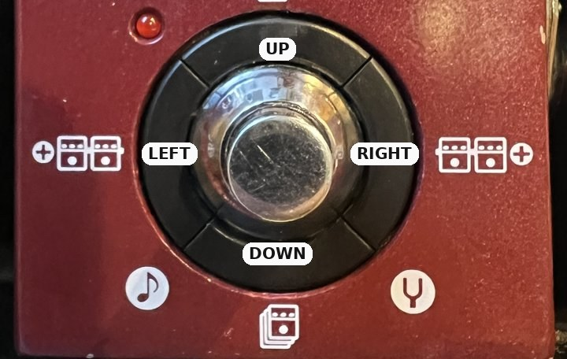
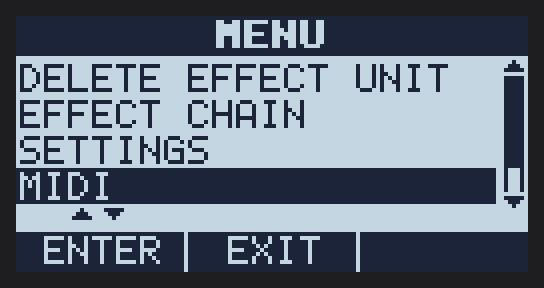
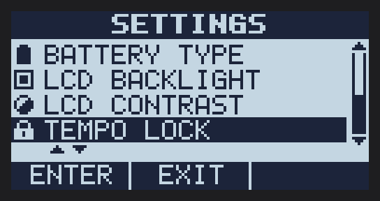

<p align="center"></p>

<h1 align="center">MIDISTOMP V1.0 user guide</h1>

<p align="center"><b>MIDI control, MIDI clock and playing aids for the Zoom MultiStomp</b></p>

<p align="center">
<a href="#2-getting-it-onto-the-pedal">Install</a> ·
<a href="#3-recovery-and-going-back-to-stock">Recovery</a> ·
<a href="#4-features">Features</a> ·
<a href="#5-midi-cc-chart">MIDI chart</a> ·
<a href="#7-known-limits-and-faq">FAQ</a> ·
<a href="#8-custom-effects">Custom effects</a> ·
<a href="#9-feedback-and-bug-reports">Feedback</a> ·
<a href="../README.md#demo">Demo</a>
</p>

<sub>Screen pictures are drawn with the pedal's own font from the firmware; the photos are of a real MS-60B.</sub>

## 1. What MIDISTOMP is

MIDISTOMP is a modified version of Zoom's own MS-50G firmware 3.10. It keeps
everything the pedal does today and adds MIDI control, MIDI clock and a few
playing aids. It is not made or supported by Zoom.

| Pedal | Status |
|---|---|
| MS-50G | Runs it. Tested with the Mac updater: PC, CC, MIDI clock, MIDI menu, channel filter, combos and HOLD FOR all work. |
| MS-60B with the MS-50G 3.10 firmware cross-flashed | Runs it; tested with the Windows updater. |
| MS-70CDR | Untested. It should boot, but stereo may not work (inferred). A tested MS-70CDR version will follow once the author has one. |
| "+" models (MS-50G+, MS-70CDR+) | No: different hardware. |

You get 6 effects per patch, like the MS-50G firmware.

If you try it on an MS-50G or MS-70CDR, please [report how it went](https://github.com/matujuice/zoom-ms-modding/issues):
every report helps.

## 2. Getting it onto the pedal

The release does not contain Zoom's firmware, so you make the MIDISTOMP
updater yourself from Zoom's official one. This needs Windows, or a Mac
(see [On a Mac](#on-a-mac) below).

1. Download [Zoom's **MS-50G System v3.10** updater for Windows](https://zoomcorp.com/it/it/multi-effects/multistomp-pedals/ms-50g/ms-50g-support/) from zoomcorp.com
   (MS-50G support page) and unzip it.
2. Download **MIDISTOMP-builder.exe** from the
   [release page](https://github.com/matujuice/zoom-ms-modding/releases).
3. Drag `ZOOM MS-50G System v3.10 Updater.exe` onto `MIDISTOMP-builder.exe`.
   It writes **MIDISTOMP V1.0 Updater.exe** in the same folder. It refuses any
   other file, so a wrong download can't produce a broken updater.
4. Windows may warn that the program is unknown (it is not signed). Choose
   "More info", then "Run anyway".
5. Pedal off. Hold the **up and down cursor keys** (above and below the
   footswitch, see the photo below) while you plug in the USB cable: the pedal shows the update screen.

   

7. Run `MIDISTOMP V1.0 Updater.exe` and let it finish. Don't unplug during the update.
8. Unplug and power on normally. The boot screen reads **MIDISTOMP MOD v1.0** and
   the last menu entry reads **V1.0**.

   

Your patches and installed effects stay as they are. The updater never
rewrites the pedal's bootloader, which keeps the update mode always available.

### On a Mac

Zoom's Mac updater holds the same firmware files as the Windows one and runs
the same flash steps, so a MIDISTOMP version of it can be built too. The
build has been checked byte for byte against the Windows MIDISTOMP updater
and flashed to an MS-50G from an Apple Silicon Mac.

1. Download Zoom's **MS-50G v3.10** updater **for Mac** from the support page
   and unzip it.
2. Get this repository and Python 3, then in its folder:
   ```sh
   python3 -m venv .venv && .venv/bin/pip install -e .
   .venv/bin/python scripts/midistomp_builder.py "/path/to/ZOOM MS-50G v3.10 Updater.app"
   ```
   It writes **MIDISTOMP V1.0 Updater.app** next to Zoom's app, and refuses
   anything that is not Zoom's original.
3. Changing the app breaks Zoom's code signature, so sign it for your own Mac:
   ```sh
   xattr -cr "/path/to/MIDISTOMP V1.0 Updater.app"
   codesign --force --deep --sign - "/path/to/MIDISTOMP V1.0 Updater.app"
   ```
4. Put the pedal in update mode (step 5 above) and open the app. It is an
   Intel app, so Apple Silicon Macs run it through Rosetta (macOS offers to
   install it).

Recovery works the same way, with Zoom's original Mac updater.

## 3. Recovery and going back to stock

If the pedal doesn't boot, or you want stock firmware back:

1. Enter update mode (step 5 above: hold up + down while plugging in USB).
   This works even when the firmware is broken.
2. Run Zoom's original MS-50G 3.10 updater. It puts back the stock firmware and
   the stock boot screen.

On an MS-60B you can also run Zoom's MS-60B updater to go back to the bass
firmware (4 effects per patch).

## 4. Features

All MIDI goes over the USB cable: from a computer, an iPad/iPhone, or a
USB-MIDI host box for hardware like a drum machine.

<p> </p>

**MIDI menu.** The menu (press the left knob in the effect chain view) has a
new **MIDI** entry:

| Row | Choices | Default |
|---|---|---|
| CLOCK RECEIVE | ON / OFF | ON |
| TRANSPORT RECEIVE (Start/Stop) | ON / OFF | ON |
| PROG CH RECEIVE | ON / OFF | ON |
| PROG CH START NO. | 0 / 1 | 1 |
| CC RECEIVE | ON / OFF | ON |
| MIDI CHANNEL | OMNI, 1-16 | OMNI |

Settings are kept after power-off. Clock, Start and Stop have no channel and
are never filtered by MIDI CHANNEL.

**Program Change** loads a patch: with START NO. 1, PC 1 = patch 1 ... PC 50 =
patch 50. With START NO. 0, PC 0 = patch 1.

**Control Change** turns effects on and off and moves knobs (chart in section 5).
The screen follows.

**MIDI clock** sets the patch tempo, like tap tempo does, so tempo-synced
delays and modulations follow your DAW or drum machine (40-250 BPM). The tempo
locks after about 2 beats and follows changes. Some stock effects (for example
Delay) restart their echoes on every tempo change, as they do with tap tempo;
TapeEcho changes smoothly.

**Start / Stop** reset and stop the beat count used by custom effects from
[zoom-ms-zdl-effects-pack](https://github.com/matujuice/zoom-ms-zdl-effects-pack),
so they stay on the beat and restart on the downbeat.



**TEMPO LOCK** (last row of SETTINGS, default OFF): changing patch keeps the
current tempo. Tap tempo, the tempo screen and MIDI clock still change it.

<p> </p>

**Tempo screen.** Press the knob labelled **TEMPO**: the screen shows the BPM
and **TURN OR TAP**. Turn the knob for 1 BPM steps or tap the footswitch; it
closes 2 s after the last turn or tap. While MIDI clock arrives it reads
**MIDI CLOCK** and can't be changed by hand.


**HOLD FOR** (SETTINGS): what holding the footswitch does.
- TUNER (default): opens the tuner, as stock.
- TEMPO: opens the tempo screen.
- MOMENTARY: a short press flips the effect as usual; hold it over half a
  second and it flips back when you let go. The flip-back is never saved.

**Button combos** (effect chain or effect screen):
- hold **down + right** about 1 s: tuner
- hold **down + left** about 1 s: tempo screen

The pedal already marks them: the note icon sits under down + left, the
tuning fork under down + right (photo in section 2).

In the tuner, pressing the middle knob (**EXIT**) goes back to the effects.

## 5. MIDI CC chart

Any channel unless MIDI CHANNEL is set. Effect n is the n-th effect of the patch.

| | Effect 1 | Effect 2 | Effect 3 | Effect 4 | Effect 5 | Effect 6 |
|---|---|---|---|---|---|---|
| On/off (0-63 off, 64-127 on) | 14 | 24 | 34 | 44 | 54 | 64 |
| Knob 1 | 15 | 25 | 35 | 45 | 55 | 65 |
| Knob 2 | 16 | 26 | 36 | 46 | 56 | 66 |
| Knob 3 | 17 | 27 | 37 | 47 | 57 | 67 |
| Knob 4 | 18 | 28 | 38 | 48 | 58 | 68 |
| Knob 5 | 19 | 29 | 39 | 49 | 59 | 69 |
| Knob 6 | 20 | 30 | 40 | 50 | 60 | 70 |
| Knob 7 | 21 | 31 | 41 | 51 | 61 | 71 |
| Knob 8 | 22 | 32 | 42 | 52 | 62 | 72 |
| Knob 9 | 23 | 33 | 43 | 53 | 63 | 73 |

Knob values 0-127 cover the knob's whole range. A knob the effect doesn't
have, and any other CC, does nothing.

## 6. Effect Manager

Zoom's Effect Manager and Zoom Effect Manager 2 work in **normal mode**
(adding, removing and ordering effects); MIDISTOMP stays installed.

**Never use an Effect Manager's firmware update mode** on a MIDISTOMP pedal:
it can rewrite the firmware and remove MIDISTOMP (inferred, not tested).

## 7. Known limits and FAQ

- **MIDI only over USB.** The pedal has no MIDI DIN jacks; hardware needs a
  USB-MIDI host box.
- **Clock through an app.** Apps that regenerate the clock (for example Loopy
  Pro) can add lag; pass the clock through unchanged if you can.
- **Some delays cut out on tempo changes.** That is the effect itself (see
  MIDI clock above).
- **MS-70CDR** is untested; stereo may not work.
- **Going back to an older MIDISTOMP or stock** may start the pedal on patch 1
  once.
- *Is my pedal at risk?* The bootloader is never rewritten, so update mode is
  always there to recover, as in section 3.
- *Why do I need Zoom's updater?* Zoom's firmware can't be shared here; the
  builder only changes your own copy.
- *Found a bug or something unclear in this guide?* Please
  [open an issue](https://github.com/matujuice/zoom-ms-modding/issues), see section 9.

## 8. Custom effects

Stock effects work with MIDISTOMP (clock sets their tempo, CC moves their
knobs), but they have limits: they ignore Start/Stop, some delays cut out on
tempo changes, and nothing locks to the bar.

The free effects in [zoom-ms-zdl-effects-pack](https://github.com/matujuice/zoom-ms-zdl-effects-pack) are built around
MIDISTOMP: they follow the pedal's tempo, lock to the clock's grid, restart on
the downbeat with MIDI Start and keep going after Stop. They are the best way
to use this firmware, and the pack is updated often with new effects. Install
them with Effect Manager in normal mode (section 6).

## 9. Feedback and bug reports

Please [open an issue](https://github.com/matujuice/zoom-ms-modding/issues) for anything that doesn't work, anything
confusing, or an idea. Say which pedal and MIDISTOMP version you have, what
you did and what happened; a phone photo of the screen helps. Reports from
MS-50G and MS-70CDR owners are especially welcome.
